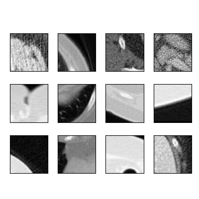
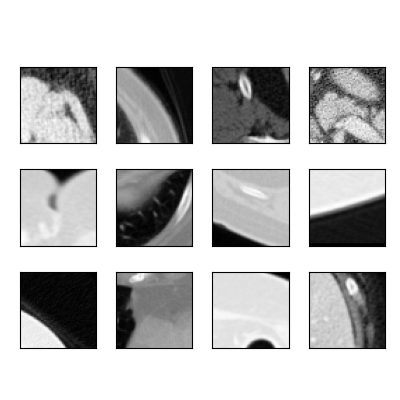

## mpi4py based feature extraction/patch generation for Deep Learning from CT images

## Highlights

(1) Performs patch based feature extracting from raw training set in Parallel<br>
(2) Includes different options for data normalization<br>
(3) Includes rotation and scaling based augmentation<br>
(4) Includes air thresholding to discard non-contrast regions<br>
(5) Includes contrast blending based augmentation<br>

```
usage: main.py [-h] --input-folder INPUT_FOLDER [--output-fname OUTPUT_FNAME] [--patch-size PATCH_SIZE]
               [--normalization-type NORMALIZATION_TYPE] [--tensor-format TENSOR_FORMAT] [--random_N] [--rot_augment]
               [--ds_augment] [--air_threshold] [--blurr_n_noise] [--mpi_run] [--dose_blend] [--sanity_plot_check] 
               [--nsplit NSPLIT] [--out-dtype OUT_DTYPE] [--input-gen-folder INPUT_GEN_FOLDER]
               [--target-gen-folder TARGET_GEN_FOLDER] [--img-format IMG_FORMAT]

Storing input-target images as patches in h5 format from all patient data /
category sets

optional arguments:
  -h, --help            show this help message and exit
  --input-folder        directory name containing images
  --output-fname        output filename to save patched h5 file
  --patch-size          p96 or p75 or p55 or p42 or p24 or p12. p96 yields 96x96 patched window
  --normalization-type  None or unity_independent or unity_wrt_ld or std_independent or std_wrt_ld. 
                        For more info look at function img_pair_normalization in utils.py
  --tensor-format       other option is tf. Depending upon the DL API tool, h5 input and target patches are saved accordingly. 
                        Eg. torch tensor [batch_size, c, h, w]
  --random_N            extracts random N complimentary images from input - target folders. For more info refer to 
                        in-built options.
  --rot_augment         employs rotation-based augmentation
  --ds_augment          incorperate downscale based data augmentation
  --air_threshold       removes patches devoid of contrast
  --blurr_n_noise       whether or not you want to add noise and blurr input data. Non-funtional in for the mpi-run. 
                        Only works in serial run (for now).
  --mpi_run             if you want to employ mpi-based parallel computation
  --dose_blend          if you want to employ dose blend-base data
                        augmendation
  --sanity_plot_check   if you want to view some of the patched plots
  --nsplit              no. of h5 files containing n chunks of patches
  --out-dtype           array type of output h5 file. Options include float32,
                        float64, int16, uint16.
  --input-gen-folder    folder name containing noisy (input) measurements
  --target-gen-folder   folder name containing clean (target) measurements
  --img-format          image format for input and target images.
  --shuffle-patches     options include np_shuffle or none

``` 

## Example usage

```
$ mpiexec -n 8 python main.py --input-folder './raw_data' --output-fname './results/training_patches.h5' \
--patch-size 'p55' --mpi_run --rot_augment --out-dtype 'float16' --ds_augment --air_threshold --dose_blend --nsplit 2 \
--input-gen-folder 'quarter_3mm_sharp_sorted' --target-gen-folder 'full_3mm_sharp_sorted' --sanity_plot_check
```
> > Instead you may choose to (modify &) execute patch generating bash file as:
```
$ chmod +x demo_run.sh
$ ./demo_run.sh
```

## Results
<br>
<div figcaption align = "left"><b>Input patches</b></figcaption><br>
<br>
<figcaption align = "left"><b>Target patches</b></figcaption><br>
<br>
</div>

## Package requirements
- Install mpicc compiler as:
  - `$ conda install -c anaconda mpi4py`<br>
- Use pip to install numpy, h5py, matplotlib, pydicom, glob, random, opencv-python.

## References
- Some demo images in the raw_data folder are imported from the [Low Dose CT Grand Challenge](https://www.aapm.org/GrandChallenge/LowDoseCT/)<br>
- L. Dalcin, P. Kler, R. Paz, and A. Cosimo, Parallel Distributed Computing using Python, Advances in Water Resources, 34(9) 1124-1139, 2011. http://dx.doi.org/10.1016/j.advwatres.2011.04.013
- L. Dalcin, R. Paz, M. Storti, and J. D’Elia, MPI for Python: performance improvements and MPI-2 extensions, Journal of Parallel and Distributed Computing, 68(5):655-662, 2008. http://dx.doi.org/10.1016/j.jpdc.2007.09.005
- L. Dalcin, R. Paz, and M. Storti, MPI for Python, Journal of Parallel and Distributed Computing, 65(9):1108-1115, 2005. http://dx.doi.org/10.1016/j.jpdc.2005.03.010

## License and Copyright
This software and documentation (the "Software") were developed at the Food and Drug Administration (FDA) by employees of the Federal Government in the course of their official duties. Pursuant to Title 17, Section 105 of the United States Code, this work is not subject to copyright protection and is in the public domain. Permission is hereby granted, free of charge, to any person obtaining a copy of the Software, to deal in the Software without restriction, including without limitation the rights to use, copy, modify, merge, publish, distribute, sublicense, or sell copies of the Software or derivatives, and to permit persons to whom the Software is furnished to do so. FDA assumes no responsibility whatsoever for use by other parties of the Software, its source code, documentation or compiled executables, and makes no guarantees, expressed or implied, about its quality, reliability, or any other characteristic. Further, use of this code in no way implies endorsement by the FDA or confers any advantage in regulatory decisions. Although this software can be redistributed and/or modified freely, we ask that any derivative works bear some notice that they are derived from it, and any modified versions bear some notice that they have been modified.

## Contact
Prabhat KC
prabhat.kc077@gmail.com
